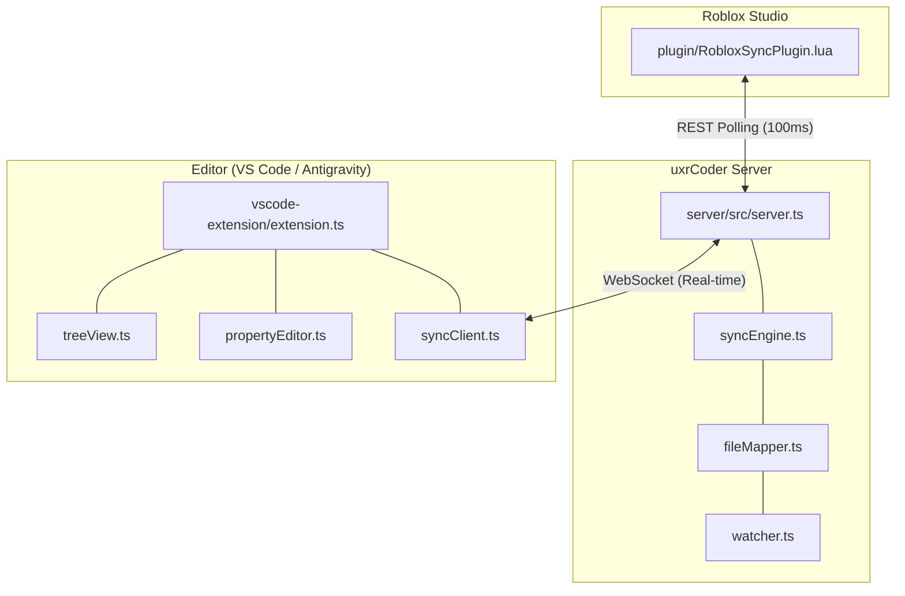

<p align="center">
  
</p>

<h1 align="center">uxrCoder</h1>

<p align="center">
  <strong>The Ultimate Pro-Grade Interface between Roblox Studio and Visual Studio Code.</strong><br>
  Built for high-performance development, AI-assisted coding, and seamless DataModel synchronization.
</p>

<p align="center">
  <a href="https://opensource.org/licenses/MIT"></a>
  <a href="https://nodejs.org/"></a>
  <a href="https://www.typescriptlang.org/"></a>
  <a href="https://github.com/UXPLIMA/uxrCoder/releases"></a>
  <a href="https://uxplima.com"></a>
</p>

---

## Why uxrCoder?

Roblox development shouldn't be confined to a singular environment. **uxrCoder** bridges the gap between the powerful Roblox DataModel and the industry-standard developer experience of VS Code and AI tools like **Antigravity**.

Designed by [UXPLIMA](https://uxplima.com), uxrCoder is engineered for low latency, high reliability, and an "it just works" experience that scales from solo developers to professional teams.

---

## Enterprise-Grade Features

### [SYNC] High-Fidelity Two-Way Synchronization
- **Neural Sync Engine**: Real-time mirroring with sub-50ms latency.
- **Bi-Directional Flow**: Change anything in Studio, see it in VS Code. Save in VS Code, see it in Studio.
- **Intelligent Conflict Resolution**: State-aware deduplication prevents data loss during concurrent edits.

### [FS] Advanced File Projection
- **Native Extension Mapping**: 
  - `Script` ➔ `.server.lua`
  - `LocalScript` ➔ `.client.lua`
  - `ModuleScript` ➔ `.lua`
- **Smart Hierarchy Management**: Handles complex nested structures while enforcing Roblox's engine constraints (e.g., Script children validation).

### [EXPLORER] Roblox DataModel Explorer
- **Native Tree View**: Integrated directly into the VS Code Activity Bar.
- **Context-Aware Actions**: Right-click to Insert, Rename, Delete, or Copy Path.
- **Live State Updates**: Real-time visual feedback of the Studio DataModel.

### [EDIT] World-Class Scripting Experience
- **Workspace-Based Editing**: Scripts open as actual files, enabling 100% compatibility with **Luau LSP**, **sourcemap.json**, and **GitHub Copilot/Cursor**.
- **Cross-Platform Compatibility**: Edit code using your favorite IDE features, then let uxrCoder handle the injection back into Studio.

### [PROPS] Integrated Property Inspector
- **Live Property Editing**: Modify positions, colors, and boolean values without leaving VS Code.
- **Rich Data Types**: Built-in support for `Vector3`, `Color3`, `UDim2`, `CFrame`, and more.

---

## Technical Architecture

uxrCoder utilizes a robust hub-and-spoke architecture centered around a high-performance Node.js relay server.



---

## Repository Structure

| Directory | Purpose |
|:--- |:--- |
| [`server/`](./server) | The core Node.js hub managing state, file watching, and API endpoints. |
| [`vscode-extension/`](./vscode-extension) | The VS Code front-end providing the UI, Tree View, and WebSocket client. |
| [`plugin/`](./plugin) | The Roblox Studio bridge responsible for DataModel injection and extraction. |
| [`shared/`](./shared) | Universal Type Definitions sharing data structures across the ecosystem. |

---

## Installation & Setup

### Prerequisites
- [Node.js](https://nodejs.org/) 18.x or later
- [Roblox Studio](https://www.roblox.com/create)
- [Visual Studio Code](https://code.visualstudio.com/)

### Quick Start (Manual Setup)
1. **Clone & Install Dependencies**
   ```bash
   git clone https://github.com/UXPLIMA/uxrCoder.git
   cd uxrCoder
   npm run setup
   ```
2. **Start the Sync Hub**
   ```bash
   npm run dev
   ```
3. **Install the Plugin**
   - Copy `plugin/RobloxSyncPlugin.lua` to your Roblox Local Plugins folder.
4. **Launch VS Code Extension**
   - Open the project in VS Code and press `F5` to start the extension.

---

## Usage Patterns

| Action | Visual Studio Code | Roblox Studio |
| :--- | :--- | :--- |
| **Open Script** | Double-click in Explorer | Double-click in Explorer |
| **New Instance** | Right-click ➔ Insert Object | Insert via Advanced Objects |
| **Edit Data** | Modify in Property Panel | Modify in Properties Window |
| **Sync Check** | Status Bar Indicator | Plugin Status Button |

### Pro-Tips
- **AI Coding**: Use Antigravity/Cursor on the mapped `.lua` files for superior results compared to the built-in Studio editor.
- **Server Restart**: uxrCoder features **Auto-Resync**. If you restart the server, the plugin detects it and automatically restores the state.

---

## Configuration

### Workspace Mapping (`uxrcoder.project.json`)
```json
{
  "name": "ProjectAlpha",
  "tree": {
    "$className": "DataModel",
    "ReplicatedStorage": {
      "$path": "src/shared"
    }
  }
}
```

---

## Development Roadmap

- [PHASE 6] Drag & Drop support in Tree View.
- [PHASE 7] Built-in Asset Preview for Decals/Sounds.
- [PHASE 8] Team Create cloud-relay support.
- [PHASE 9] Advanced conflict resolution UI.

---

## Contributing

We welcome contributions from the community!

1. Fork the Project
2. Create your Feature Branch (`git checkout -b feature/AmazingFeature`)
3. Commit your Changes (`git commit -m 'Add some AmazingFeature'`)
4. Push to the Branch (`git checkout -b feature/AmazingFeature`)
5. Open a Pull Request

---

## License

Distributed under the MIT License. See [`LICENSE`](./LICENSE) for more information.

---

<p align="center">
  <strong>Built by <a href="https://uxplima.com">UXPLIMA</a></strong><br>
  <em>Innovating the future of Roblox Development.</em>
</p>
