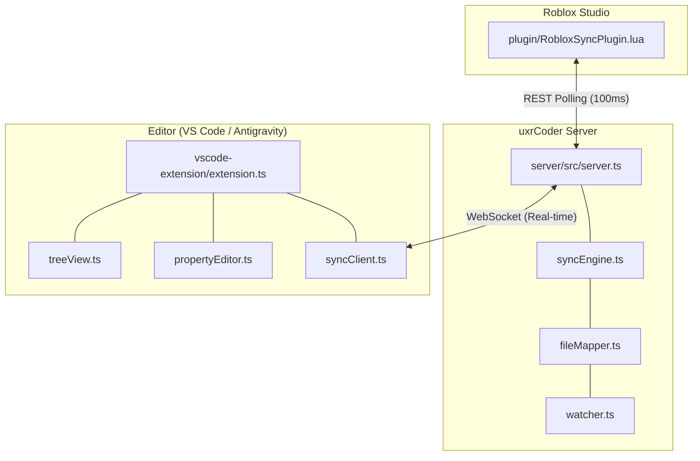

# Technical Architecture

uxrCoder utilizes a robust hub-and-spoke architecture centered around a high-performance Node.js relay server. This design ensures low-latency communication between the Roblox Studio environment and external editors like VS Code.

## Architecture Diagram

## Component Breakdown

### 1. Sync Server (`server/`)
The central hub for data flow.
- **SyncEngine**: Manages the state of the Roblox DataModel and detects differences between Studio and the file system.
- **FileMapper**: Maps Roblox instances to the physical file system hierarchy.
- **Watcher**: Monitors the local file system for source code changes.

### 2. VS Code Extension (`vscode-extension/`)
The primary developer interface.
- **Explorer View**: A real-time tree view of the Roblox DataModel project.
- **SyncClient**: WebSocket client that maintains a persistent connection to the server.
- **Property Editor**: A custom webview for modifying instance properties.

### 3. Roblox Plugin (`plugin/`)
The bridge within Roblox Studio.
- **HttpService REST**: High-frequency polling to send DataModel updates and retrieve pending changes.
- **DataModel Serialization**: Efficiently packs Roblox instances into a standardized JSON format.
- **Change Collector**: Tracks property changes and instance life-cycles within Studio.

## Performance Metrics
- **Sync Latency**: < 50ms for property updates.
- **Polling Frequency**: 10Hz (100ms interval).
- **Communication Protocol**: WebSocket (Server ↔ Extension) and REST (Server ↔ Plugin).
